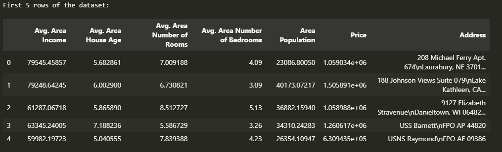
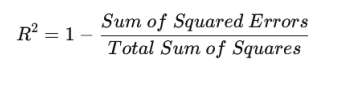
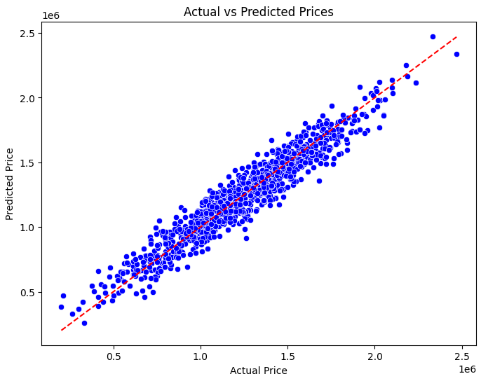
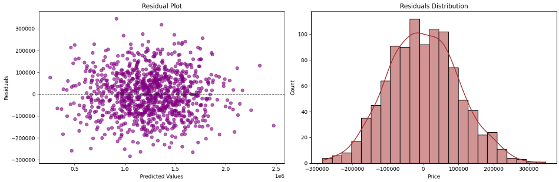

## 🧠 Machine Learning Lab 04: Linear Regression with Multiple features & Model Evaluation

Welcome to **Machine Learning Lab 04**, where we dive deeper into **Linear Regression**, model evaluation, and performance analysis using Python. This lab focuses on understanding regression metrics, residual analysis, and improving model accuracy.

---

## 📋 [Table of Contents](#table-of-contents)
- [Introduction](#introduction)
- [Objectives](#objectives)
- [Dataset Description](#dataset-description)
- [Implementation Steps](#implementation-steps)
  - [1. Data Loading](#1-data-loading)
  - [2. Data Preprocessing](#2-data-preprocessing)
  - [3. Model Training](#3-model-training)
  - [4. Model Evaluation](#4-model-evaluation)
- [Results & Visualizations](#results--visualizations)
- [Lab Questions & Answers](#lab-questions--answers)
- [References](#references)

---

## 📌 Introduction
In this lab, we focus on implementing **Simple Linear Regression** to predict target variables based on a single independent feature. Additionally, we evaluate the model's performance using statistical metrics like **R-squared**, **Mean Squared Error (MSE)**, and **Residual Plots**.

---

## 🎯 Objectives
- Understand Linear Regression concepts
- Implement regression models using **scikit-learn**
- Evaluate model performance using key metrics
- Visualize regression results for better insights

---

## 📊 Dataset Description
The dataset includes the following features:
- **Avg. Area Income**: Average income of residents in the area
- **Avg. Area House Age**: Average age of houses
- **Avg. Area Number of Rooms**: Average number of rooms per house
- **Avg. Area Number of Bedrooms**: Average number of bedrooms per house
- **Area Population**: Population of the area
- **Price**: Target variable (House price)
- **Address**: Address of the property
  <br>
  

---

## ⚡ Implementation Steps

### 1. Data Loading
```python
import pandas as pd
data = pd.read_csv("housing.csv")
data.head()
```

### 2. Data Preprocessing
- Handle missing values
- Normalize/standardize features if needed

### 3. Model Training
```python
from sklearn.linear_model import LinearRegression
model = LinearRegression()
model.fit(X_train, y_train)
```

### 4. Model Evaluation
- **R-squared (R²) Formula:**\


- **Mean Squared Error (MSE) Formula:**\
  **`MSE = (1/n) * Σ (yi - ŷi)^2`**\
  Where:

  - `yi` = Actual values
  - `ŷi` = Predicted values
  - `n` = Number of observations
```python
from sklearn.metrics import mean_squared_error, r2_score
predictions = model.predict(X_test)
print("R-squared:", r2_score(y_test, predictions))
print("MSE:", mean_squared_error(y_test, predictions))
```

---

## 📈 Results & Visualizations
- **Regression Line Plot:** Shows the best-fit line against actual data points
  <br>
  
- **Residual Plot:** Evaluates the distribution of prediction errors
  <br>
  


---

## ❓ Lab Questions & Answers

1. **What is the significance of the R-squared value in linear regression?**  
   R-squared indicates how well the model explains the variability of the target variable. A value closer to 1 means a better fit.

2. **How do residual plots help in evaluating model performance?**  
   Residual plots help identify patterns, indicating whether the model's assumptions are valid. Randomly scattered residuals suggest a good model fit.

3. **What are the key assumptions of linear regression?**  
   - Linearity
   - Independence of errors
   - Homoscedasticity (constant variance)
   - Normal distribution of errors

4. **How can we improve the performance of our regression model?**  
   - Feature engineering
   - Polynomial regression
   - Removing outliers
   - Regularization techniques

---

## 📚 References
- [Scikit-learn Documentation](https://scikit-learn.org/stable/modules/linear_model.html)
- [Pandas Documentation](https://pandas.pydata.org/docs/)
- [Matplotlib for Visualizations](https://matplotlib.org/stable/contents.html)

---

## 🙌 Thank You!
Thank you for exploring this lab. Feel free to ⭐ the repository if you found it useful!

