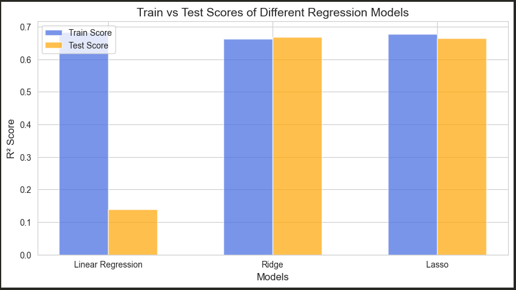

# 📌 Lab 05: Overfitting and Regularization in Linear Regression

## 📖 Overview
This repository contains **Lab 05** of the Machine Learning course, focusing on **Overfitting and Regularization** in **Linear Regression**. The lab covers:
✅ Linear Regression (Baseline Model)  
✅ Ridge Regression (L2 Regularization)  
✅ Lasso Regression (L1 Regularization)  

## 📂 Repository Link
🔗 [Machine Learning Lab on GitHub](https://github.com/habibkhan099/Machine-Learning-Lab)

## 📊 Dataset
The dataset used in this lab is **Melbourne_housing_FULL.csv**, which contains multiple features for predicting `Price`. 
Key aspects of preprocessing include:
- Handling missing values
- Encoding categorical variables using `pd.get_dummies()`
- Splitting data into training and testing sets

## 🚀 Getting Started
To run the Jupyter Notebook, follow these steps:
```bash
# Clone the repository
git clone https://github.com/habibkhan099/Machine-Learning-Lab.git

# Navigate to the directory
cd Machine-Learning-Lab

# Open the notebook
jupyter notebook Lab05.ipynb
```

## 🔬 Methodology
1️⃣ **Data Preprocessing**
   - Handling missing values
   - Encoding categorical variables
   - Splitting dataset into train and test sets  
2️⃣ **Model Training**
   - Linear Regression
   - Ridge Regression (L2 Regularization)
   - Lasso Regression (L1 Regularization)  
3️⃣ **Performance Evaluation**
   - R² Score comparison on training and testing datasets
   - Overfitting analysis
   - Feature selection impact

## 📈 Results
| Model              | Train Score | Test Score |
|-------------------|------------|-----------|
| Linear Regression | 0.6828     | 0.1385    |
| Ridge Regression  | 0.6622     | 0.6671    |
| Lasso Regression  | 0.6767     | 0.6636    |

## 📊 Visualization
Below is a plot comparing **Train vs Test Scores**:



## 🎯 Key Takeaways
- **Linear Regression** overfits the data as the train score is high, but the test score is significantly low.
- **Ridge and Lasso Regression** reduce overfitting and improve test performance.
- **Lasso Regression** helps in feature selection by shrinking some coefficients to zero.

## 📚 References
📖 Hastie, T., Tibshirani, R., & Friedman, J. (2009). *The Elements of Statistical Learning*  
📖 Scikit-learn Documentation: [https://scikit-learn.org/](https://scikit-learn.org/)  
📖 Andrew Ng's Machine Learning Course  

---
👨‍💻 **Author:** Habib Khan  
📩 For any queries, feel free to raise an issue in the repository! 🚀

