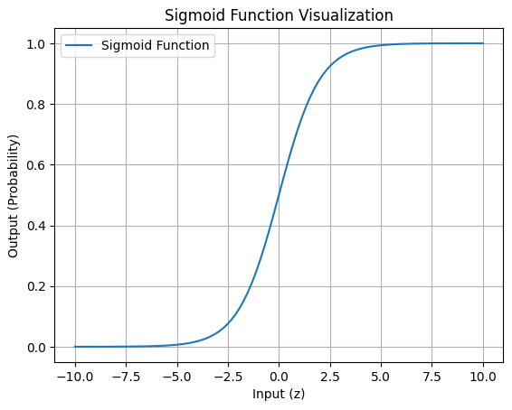
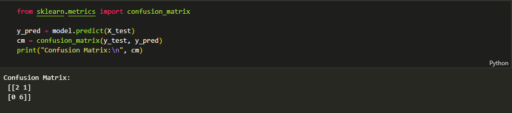
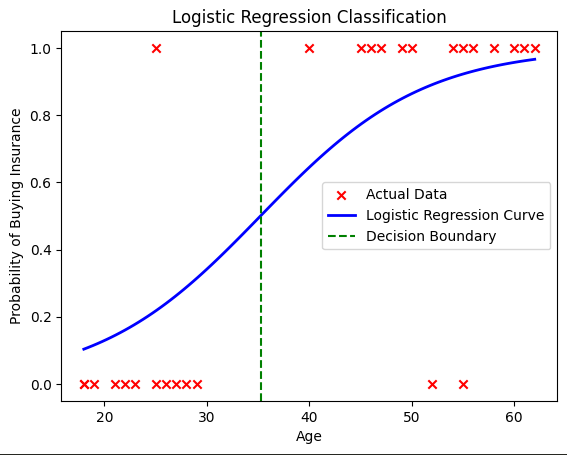

# 📊 Lab 07: Logistic Regression

## 📝 Overview
This repository contains **Lab 07: Logistic Regression**, where we explore binary classification using Logistic Regression. The lab covers:
- Understanding the sigmoid function and logistic regression equation.
- Implementing logistic regression using **Scikit-Learn**.
- Evaluating model performance with **accuracy, probability predictions, and confusion matrix**.
- Modifying train-test splits to analyze performance changes.

---

## 📁 Repository Structure
- **Lab07.ipynb**: Jupyter Notebook containing all code and explanations.
- **insurance_data.csv**: Dataset used for training and testing.
- **images/**: Folder containing output visualizations.

---

## 📜 Logistic Regression Formula
Logistic regression uses the **sigmoid function**:

$$
\sigma(z) = \frac{1}{1 + e^{-z}}
$$

where:  
- \(z = wX + b\) is the linear combination of input features \(X\), weights \(w\), and bias \(b\).  
- \(e\) is Euler’s number (approximately 2.718).  
- The model predicts \(P(Y=1|X)\) as the probability of class 1.

---

## 🚀 How to Run
```bash
# Clone the repository
git clone <repository-link>
cd <repository-folder>

# Run the notebook
jupyter notebook Lab07.ipynb
```

---

## 🔬 Lab Tasks

### **1️⃣ Predict Probability of Buying Insurance**
- Used `model.predict_proba(X_test)` to get probability estimates instead of class labels.
- 📌 **Visualization:** Probability distribution plot.

### **2️⃣ Modify Training Data Split Ratio**
- Changed **train-test split** from **80-20** to **70-30** and **60-40**.
- Observed how **accuracy changed** with different splits.
- 📌 **Results:** Accuracy differences between splits.

### **3️⃣ Evaluate Model Performance Using a Confusion Matrix**
- Used `confusion_matrix(y_test, y_pred)` to analyze **true positives, false positives, true negatives, and false negatives**.
- 📌 **Visualization:** Confusion matrix heatmap.

### **4️⃣ Visualize the Sigmoid Function**
- Plotted the **sigmoid function** to understand probability mapping.
- 📌 **Graph:** Sigmoid curve between -10 and 10.

### **5️⃣ Test Model on New Data**
- Manually tested a new **age value (e.g., 45)** using `model.predict()`.
- 📌 **Output:** Determined whether a person is likely to buy insurance.

---

## 📊 Results and Insights
- **Accuracy Score:** Calculated using `model.score(X_test, y_test)`.
- **Confusion Matrix Analysis:** Showed model performance on correct vs. incorrect predictions.
- **Effect of Train-Test Split:** More training data improved model generalization.

---

## 📷 Output Visualizations
- **Sigmoid Function Plot**:
  <br> 
- **Confusion Matrix**:
  <br> 
- **Decision Boundary**:
  <br> 

---

## 🛠️ Tools & Libraries Used
- Python, NumPy, Pandas, Matplotlib
- Scikit-Learn for logistic regression and evaluation

---

## 📚 Citations
- Hastie, T., Tibshirani, R., & Friedman, J. (2009). *The Elements of Statistical Learning*.
- [Scikit-Learn Documentation](https://scikit-learn.org/)

---

## 🚀 Open in Google Colab
[](https://colab.research.google.com/github/habibkhan099/Machine-Learning-Lab/blob/main/Lab07.ipynb)

👨‍💻 **Author:** Habib Ullah 
📩 For any questions, feel free to raise an issue in the repository!
