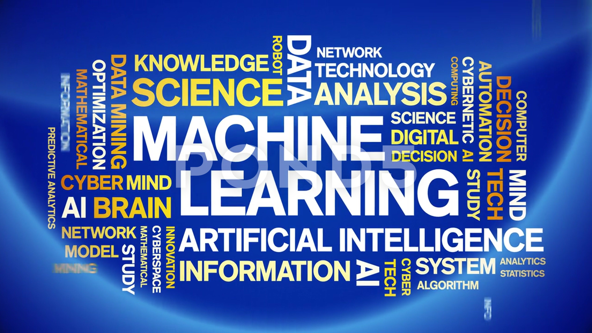

# Machine Learning Lab 

Welcome to the **Machine Learning Lab** repository ! This repository contains all the labs and projects completed as part of my Machine Learning coursework. Each lab focuses on different machine learning concepts, algorithms, and techniques, implemented using Python and popular libraries like Scikit-Learn, Pandas, and Matplotlib.




---

## Repository Overview

This repository is organized into individual labs, each covering a specific topic in machine learning. Below is a list of the labs included in this repository:

1. **Lab 01: Python Basics and File Handling**
   - Covers fundamental Python programming, file handling (JSON and CSV), and Jupyter Notebook basics.

2. **Lab 02: Exploratory Data Analysis (EDA)**
   - Focuses on data exploration, visualization, and preprocessing using the Iris dataset.

3. **Lab 03: Linear Regression Using One feature**
   - Implements linear regression for predicting house prices using one feature.

4. **Lab 04: Linear Regression with Multiple Variables**
   - Implements linear regression for predicting house prices with Multiple Variables.

5. **Lab 05: Overfitting and Regularization in Linear Regression**
   - Applies the K-Means clustering algorithm to group data points.

6. **Lab 06: Sentiment Analysis**
   - Performs sentiment analysis on text data using natural language processing (NLP) techniques.

---

## Labs and Projects

### Lab 01: Python Basics and File Handling
- **Description**: Introduction to Python programming, file handling (JSON and CSV), and Jupyter Notebook basics.
- **Notebook**: [Lab01.ipynb](Lab01/Lab01.ipynb)

### Lab 02: Exploratory Data Analysis (EDA)
- **Description**: Data exploration, visualization, and preprocessing using the Iris dataset.
- **Notebook**: [Lab02.ipynb](Lab02/Lab02.ipynb)

### Lab 03: Linear Regression
- **Description**: Implementation of linear regression for predicting house prices.
- **Notebook**: [Lab03.ipynb](Lab03/Lab03.ipynb)

### Lab 04: Classification Using Decision Trees
- **Description**: Classification using decision trees on a sample dataset.
- **Notebook**: [Lab04.ipynb](Lab04/Lab04.ipynb)

### Lab 05: Clustering with K-Means
- **Description**: Application of the K-Means clustering algorithm to group data points.
- **Notebook**: [Lab05.ipynb](Lab05/Lab05.ipynb)

### Lab 06: Sentiment Analysis
- **Description**: Sentiment analysis on text data using NLP techniques.
- **Notebook**: [Lab06.ipynb](Lab06/Lab06.ipynb)

---
## Repository Structure

```
Machine-Learning-Lab-Computer-Engineering/
├── Lab01/                        # Lab 01: Python Basics and File Handling
│   ├── Lab01.ipynb               # Jupyter Notebook for Lab 01
│   ├── items.json                # JSON file created in Lab 01
│   ├── General.csv               # CSV file created in Lab 01
│   └── README.md                 # Lab 01 README
├── Lab02/                        # Lab 02: Exploratory Data Analysis (EDA)
│   ├── Lab02.ipynb               # Jupyter Notebook for Lab 02
│   └── README.md                 # Lab 02 README
├── Lab03/                        # Lab 03: Linear Regression
│   ├── Lab03.ipynb               # Jupyter Notebook for Lab 03
│   └── README.md                 # Lab 03 README
├── Lab04/                        # Lab 04: Classification Using Decision Trees
│   ├── Lab04.ipynb               # Jupyter Notebook for Lab 04
│   └── README.md                 # Lab 04 README
├── Lab05/                        # Lab 05: Clustering with K-Means
│   ├── Lab05.ipynb               # Jupyter Notebook for Lab 05
│   └── README.md                 # Lab 05 README
├── Lab06/                        # Lab 06: Sentiment Analysis
│   ├── Lab06.ipynb               # Jupyter Notebook for Lab 06
│   └── README.md                 # Lab 06 README
├── LICENSE                       # License file for the repository
└── README.md                     # This file
```

---

## How to Use This Repository

1. **Clone the Repository**:
   ```bash
   git clone https://github.com/your-username/Machine-Learning-Lab-Computer-Engineering.git
   ```
2. **Navigate to a Lab Folder**:
   ```bash
   cd Machine-Learning-Lab-Computer-Engineering/Lab01
   ```
3. **Open the Jupyter Notebook**:
   ```bash
   jupyter notebook Lab01.ipynb
   ```
4. **Run the Code**:
   - Execute the cells in the notebook to run the code and see the results.

---

## Dependencies

To run the code in this repository, you need the following Python libraries:
- Python 3.x
- Jupyter Notebook
- NumPy
- Pandas
- Matplotlib
- Seaborn
- Scikit-Learn

Install the dependencies using:
```bash
pip install numpy pandas matplotlib seaborn scikit-learn notebook
```

---

## License

This project is licensed under the **MIT License**. See the [LICENSE](LICENSE) file for details.

---

## Acknowledgments

- The labs in this repository are inspired by various open-source machine learning projects and tutorials.
- Special thanks to the instructors **Dr. Waqar Ahmad** and peers who provided guidance and support during the coursework.

---

## 🙌 Thank You!  
Thank you for visiting this project! If you found it useful, feel free to ⭐ the repository and contribute to future improvements. 🚀
